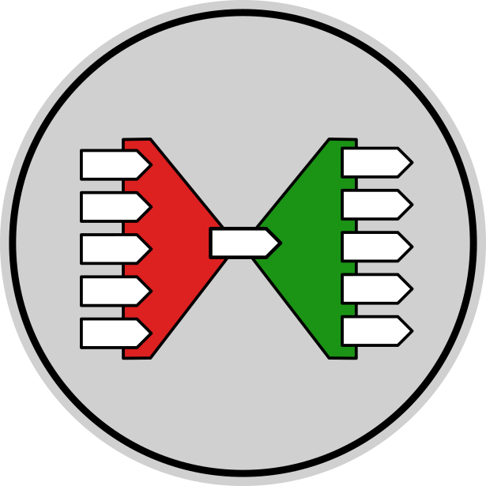

# Intertwine Normalizing Interface Invocations

A framework for automatically converting method invocations of any programmatic interface into a single-method _**normal form**_ and converting back to invocations of the original interface.

## Description

For a full explanation of what Intertwine is, what problem it solves, and how it solves it, please read this post on my blog: [michael.gr - Intertwine](https://blog.michael.gr/2022/12/intertwine.html)

The following text assumes that you have already read the blog post and that you fully understand it.

The solution contains the following projects:

1. Intertwine - This is the central class library which accomplishes all the magic.

2. InterfaceEvents - Sample class library project which acts as a proof-of-concept and demonstration of Intertwine.  It offers multicast events that invoke interfaces instead of delegates.

3. Test - Tests for Intertwine and InterfaceEvents

4. Benchmark - A console application performing a speed comparison between Intertwine, hand-written code that achieves the same thing, Castle Dynamic Proxy with reflecting Untwiner, and LinFu Dynamic Proxy with reflecting Untwiner.

## Appendix: Things to fix

- Make the `Intertwine.Factory` class instantiatable instead of a singleton, get rid of the `IsCaching` constant, and make `IsSaving` a parameter.
- Add support for a few missing types, such as `Decimal`, or make it handle all value types in a uniform way.
- Add support for creating only the entwiner class or only the untwiner class if the other one is never needed.
- Replace `int selector` with `MethodKey key` as in the Java implementation.
- See if `RegisterObserver` and `UnregisterObserver` can be implemented as `+=` and `-=` operators.

■

